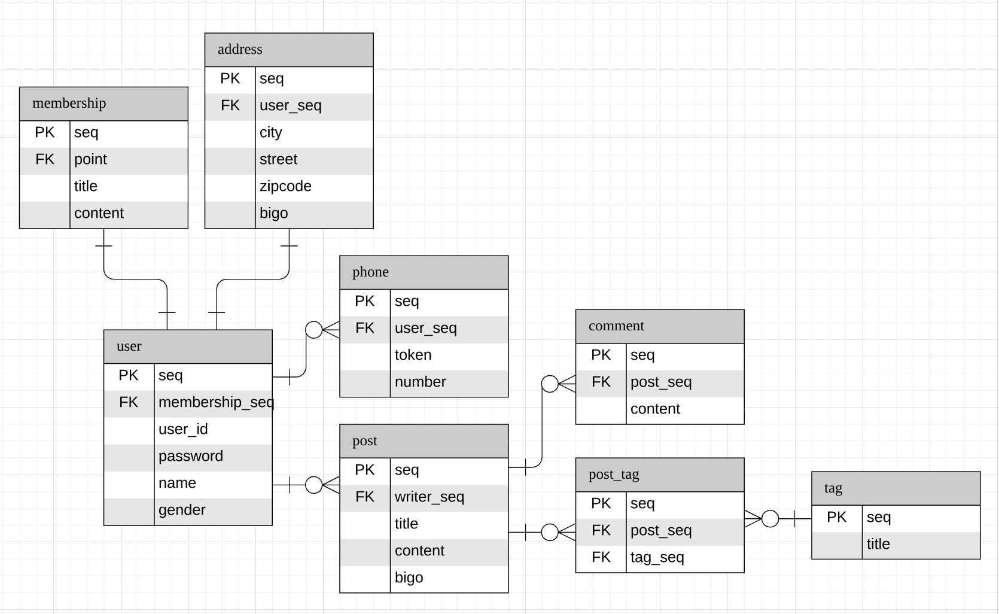

Jpa-Tutorial 
=============

<strong>Spring Boot로 Spring Data Jpa, Jpa Auditing, Envers, @DataJpaTest를 다뤄봤습니다.</strong>   

자세한 사항은 블로그를 참고해주세요 :)

blog: <https://blog.naver.com/rorean>  

개발 환경
-------------
- #### gradle
  - Spring-boot 2.1.1  
  - Java 1.8 
  - spring-boot-starter-data-jpa 
  - spring-boot-starter-devtools 
  - spring-boot-starter-web
  - spring-boot-starter-jdbc
  - commons-lang 3.3.7 
  - H2
  - Lombok
  - Envers 
                        
- #### application.yml

    
<pre><code>
server:
  port: 9090
spring:
  h2:
    console:
      enabled: true
      path: /h2-console
  jpa:
    database-platform: org.hibernate.dialect.H2Dialect
    hibernate:
      ddl-auto: update
#      ddl-auto: none
#      ddl-auto: create
  datasource:
    username: sa
    password: 
    driver-class-name: org.h2.Driver
    url: jdbc:h2:mem:jpa;DB_CLOSE_DELAY=-1;DB_CLOSE_ON_EXIT=FALSE  
</code></pre>

 

테이블 구조    
-------------
     

1.Spring Data Jpa 
-------------
Spring Framework에서 JPA를 편리하게 사용할 수 있게 Spring Data Jpa를 제공하고있습니다. JPA는 반복적인 CRUD의 굴레에서 벗어나게 해주고 간단한 SQL을 Java로 대체할 수 있습니다.

- #### Configuration   
<pre><code>
@Configuration
@EnableJpaRepositories
</code></pre>    
    
- #### JPA Annotaion
<pre><code>
@Entity
@Table
@Column 
@Id
@GeneratedValue 
</code></pre>
    
- #### Repository
<pre><code>    
public interface UserRepository extends JpaRepository<User, Long>
{
}
</code></pre>    
    

[참고파일]   
<a href="https://github.com/LEEHANI/Jpa-Tutorial/blob/master/src/main/java/com/test/web/configurations/JpaConfiguration.java">JpaConfiguration.java</a>  
<a href="https://github.com/LEEHANI/Jpa-Tutorial/blob/master/src/main/java/com/test/web/repositories/UserRepository.java">UserRepository.java</a>  
<a href="https://github.com/LEEHANI/Jpa-Tutorial/blob/master/src/main/java/com/test/web/repositories/CommonRepository.java">CommonRepository.java</a>     
#                  
- ### JPA Relation 
#### @OneToOne 단방향 (UserToMembership)

User.java   

    @OneToOne(fetch = FetchType.EAGER, cascade = CascadeType.ALL)
    @JoinColumn(name="membership_seq")
    private Membership membership;

       
       
       
#### @OneToOne 양방향 (UserToAddress)

User.java

    @OneToOne(fetch = FetchType.EAGER, mappedBy="user", cascade = CascadeType.ALL)
    @JsonManagedReference
    private Address address;

Address.java

    @OneToOne
    @JoinColumn( name = "user_seq")
    @JsonBackReference
    private User user;   

#
#### @OneToMany 단방향 (UserToPhone)
User.java

	@Default
	@OneToMany(fetch = FetchType.LAZY, cascade = CascadeType.ALL)
	@JoinColumn(name = "user_seq")
	private List<Phone> phones = new ArrayList<Phone>();

#### @OneToMany 양방향 (UserToPost)
User.java

    @Default
    @OneToMany(fetch = FetchType.LAZY, mappedBy="writer", cascade = CascadeType.ALL)
    @JsonManagedReference
    private List<Post> posts = new ArrayList<Post>();

Post.java

	@ManyToOne
	@JoinColumn( name = "writer_seq", foreignKey = @ForeignKey(name ="FKEY_WRITER_SEQ_IN_PHONE"))
	@JsonBackReference
	private User writer;

#

#### @OneToMany, @ManyToOne (@ManyToMany 변형)
 개인적으로 @ManyToMany는 복잡한 코드를 유발하고 유지 보수가 어렵다고 생각합니다. 그래서 @ManyToMany 단방향, 양방향 대신 M:N을 변형한 **1:N, N:1** 방법을 권장합니다.
 
 ##### Post.java ------< PostTag.java >------- Tag.java

Post.java

	@Default
	@OneToMany(fetch = FetchType.LAZY, mappedBy="post", cascade = CascadeType.ALL)
	@JsonManagedReference
	private List<PostTag> postTags = new ArrayList<PostTag>();
 
 Tag.java
 
	@Default
	@OneToMany(fetch = FetchType.LAZY, mappedBy="tag", cascade = CascadeType.ALL)
	@JsonBackReference
	private List<PostTag> postTags = new ArrayList<PostTag>();
    
PostTag.java

	@ManyToOne
	@JoinColumn( name = "post_seq", foreignKey = @ForeignKey(name = "FKEY_POST_SEQ_IN_POST_TAG"))
	@JsonBackReference
	private Post post;
	
	@ManyToOne(cascade = CascadeType.ALL)
	@JoinColumn( name = "tag_seq", foreignKey = @ForeignKey(name = "FKEY_TAG_SEQ_IN_POST_TAG"))
	@JsonManagedReference
	private Tag tag;
 

 
2.JPA Auditing
-------------
컬럼의 최초 생성일자와 생성자, 마지막 수정일자와 수정자를 자동으로 관리합니다. 수정일자는 데이터가 변경될 때마다 변경 시점을 자동으로 넣어주므로 마지막 변경 시점을 알 수 있습니다.    
  - #### Configuration
       
<pre><code>      
@Configuration
@EnableJpaAuditing
</code></pre>      
                
  - #### Auditing Annotaion
<pre><code>
@CreatedDate
@CreatedBy
@LastModifiedDate
@LastModifiedBy
</code></pre>     
     

위의 어노테이션을 이용하여 다음과 같이 구현해주면 됩니다.
 
    @MappedSuperclass
    @EntityListeners(value = AuditingEntityListener.class)
    public abstract class AbstractAuditing implements Serializable
    {
	    private static final long serialVersionUID = 1L;
	
	    @CreatedDate
    	@Column(name = "created_date", nullable = false, updatable = false)
        private LocalDateTime createdDate;
	
	    @CreatedBy
    	@Column(name = "created_by", nullable = true, updatable = true)
	    private String createdBy;
	
	    @LastModifiedDate
    	@Column(name = "last_modified_date", nullable = false, updatable = true)
        private LocalDateTime lastModifiedDate;
	
    	@LastModifiedBy
	    @Column(name = "last_modified_by", nullable = true, updatable = true)
	    private String lastModifiedBy;
    }
    
    
[참고 파일]    
<a href="https://github.com/LEEHANI/Jpa-Tutorial/blob/master/src/main/java/com/test/web/configurations/JpaAuditingConfiguration.java">JpaAuditingConfiguration.java</a>      
<a href="https://github.com/LEEHANI/Jpa-Tutorial/blob/master/src/main/java/com/test/web/entities/AbstractAuditing.java">AbstractAuditing.java</a>     
<a href="https://github.com/LEEHANI/Jpa-Tutorial/blob/master/src/main/java/com/test/web/configurations/Auditor.java">Auditor.java</a>

3.Envers
-------------
@Audtied 어노테이션을 추가하면 히스토리 테이블이 자동으로 생성되어 테이블의 생성, 수정, 삭제 전체 이력을 남깁니다. Audit는 마지막 수정일자, 수정자만 알고있기 때문에 데이터 추적에 어려움이 있는데, Audit와 Envers를 같이 사용하게 되면 데이터 관리, 추적에 편리합니다.

 
 
 
   - #### Envers Annotaion
   
   
    @Audited
    @NoAudted
   
 
 
 [참고 파일]         
<a href="https://github.com/LEEHANI/Jpa-Tutorial/blob/master/src/main/java/com/test/web/entities/User.java">User.java</a>

  

4.@DataJpaTest
------------
 JPA 테스트 어노테이션이다. controller, service 등을 만들지 않아도 테스트가 가능한게 장점입니다. 테스트가 끝나면 데이터는 rollback 됩니다.
 
 
   - #### Annotaion
 <pre><code>
@RunWith(SpringRunner.class)
@DataJpaTest
@AutoConfigureTestDatabase(replace = AutoConfigureTestDatabase.Replace.ANY)
@Import(JpaAuditingConfiguration.class)
</code></pre>    
          
Auditing을 사용하고 있다면 @Import(JpaAuditingConfiguration.class)를 해야합니다.
 

 
[참고파일]       
 <a href="https://github.com/LEEHANI/Jpa-Tutorial/blob/master/src/test/java/com/test/web/SpringDataJpaTest.java">SpringDataJpaTest.java</a>
 
 
 
